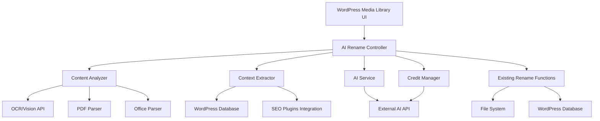

# Design Document - AI Media Renaming

## Overview

Questo documento descrive l'architettura e il design per l'integrazione dell'intelligenza artificiale nel plugin WordPress "File Media Renamer for SEO". La feature estende le funzionalità esistenti di rinomina manuale aggiungendo capacità di analisi automatica del contenuto dei media e generazione di nomi SEO-ottimizzati tramite API esterne.

Il sistema mantiene la compatibilità completa con le funzionalità esistenti e implementa un approccio graceful degradation, garantendo che il plugin continui a funzionare anche quando l'AI non è disponibile.

## Architecture

### High-Level Architecture



### Component Integration

Il sistema si integra con l'architettura esistente del plugin attraverso:

1. **Estensione dell'UI esistente**: Aggiunge pulsanti AI accanto ai controlli esistenti
2. **Riutilizzo delle funzioni di rinomina**: Utilizza `fmrseo_complete_rename_process()` esistente
3. **Integrazione con il sistema di storico**: Estende `_fmrseo_rename_history` per tracciare le operazioni AI
4. **Compatibilità con bulk rename**: Estende il sistema bulk esistente in `fmr-seo-bulk-rename.php`

## Components and Interfaces

### 1. AI Rename Controller (`FMR_AI_Rename_Controller`)

**Responsabilità:**
- Orchestrare il processo di rinomina AI
- Gestire il flusso tra analisi contenuto, estrazione contesto e chiamata AI
- Implementare fallback logic
- Interfacciarsi con il sistema di crediti

**Interfacce principali:**
```php
class FMR_AI_Rename_Controller {
    public function rename_single_media($post_id): array
    public function rename_bulk_media($post_ids, $options = []): array
    public function get_ai_suggestions($post_id, $count = 3): array
    private function handle_ai_failure($post_id, $fallback_name): array
}
```

### 2. Content Analyzer (`FMR_Content_Analyzer`)

**Responsabilità:**
- Analizzare il contenuto dei file media
- Estrarre testo e metadati rilevanti
- Gestire diversi tipi di file (immagini, PDF, documenti Office)

**Interfacce principali:**
```php
class FMR_Content_Analyzer {
    public function analyze_media($post_id): array
    private function analyze_image($file_path): array
    private function analyze_pdf($file_path): array
    private function analyze_office_document($file_path): array
    private function extract_wordpress_metadata($post_id): array
}
```

### 3. Context Extractor (`FMR_Context_Extractor`)

**Responsabilità:**
- Estrarre il contesto dalle pagine che utilizzano il media
- Integrare dati da plugin SEO
- Analizzare contenuti da page builder

**Interfacce principali:**
```php
class FMR_Context_Extractor {
    public function extract_context($post_id): array
    private function find_posts_using_media($post_id): array
    private function extract_seo_data($post_ids): array
    private function extract_page_builder_content($post_ids): array
}
```

### 4. AI Service (`FMR_AI_Service`)

**Responsabilità:**
- Gestire comunicazione con API esterne
- Costruire prompt personalizzabili
- Gestire timeout e retry logic
- Parsare risposte AI

**Interfacce principali:**
```php
class FMR_AI_Service {
    public function generate_names($content, $context, $count = 3): array
    public function test_connection(): bool
    private function build_prompt($content, $context): string
    private function make_api_request($prompt): array
    private function get_default_prompt_template(): string
}
```

### 5. Credit Manager (`FMR_Credit_Manager`)

**Responsabilità:**
- Gestire sistema di crediti
- Tracciare utilizzo
- Implementare logica di crediti gratuiti per nuovi utenti

**Interfacce principali:**
```php
class FMR_Credit_Manager {
    public function get_credit_balance(): int
    public function deduct_credit(): bool
    public function has_sufficient_credits(): bool
    public function initialize_free_credits(): void
}
```

### 6. Settings Extension (`FMR_AI_Settings`)

**Responsabilità:**
- Estendere le impostazioni esistenti con configurazioni AI
- Gestire API key e configurazioni di base
- Fornire interfaccia per abilitare/disabilitare AI

**Interfacce principali:**
```php
class FMR_AI_Settings {
    public function add_ai_settings_fields(): void
    public function validate_api_key($api_key): bool
    public function is_ai_enabled(): bool
}
```

## Data Models

### AI Rename History Extension

Estende il meta field `_fmrseo_rename_history` esistente:

```php
$history_entry = [
    'file_path' => string,
    'file_url' => string, 
    'seo_name' => string,
    'timestamp' => int,
    'method' => 'ai|manual', // Nuovo campo
    'ai_suggestions' => array, // Nuovo campo (opzionale)
    'credits_used' => int, // Nuovo campo (opzionale)
];
```

### AI Configuration Options

Estende `fmrseo_options`:

```php
$ai_options = [
    'ai_enabled' => bool,
    'api_key' => string,
    'api_endpoint' => string,
    'timeout' => int,
    'max_retries' => int,
    'fallback_enabled' => bool,
];
```

### Credit Tracking

Nuovo meta field `_fmrseo_ai_credits`:

```php
$credit_data = [
    'balance' => int,
    'used_total' => int,
    'last_updated' => int,
    'free_credits_initialized' => bool,
    'transactions' => [
        [
            'type' => 'deduct|add',
            'amount' => int,
            'timestamp' => int,
            'post_id' => int, // opzionale
            'operation' => 'single|bulk',
        ]
    ]
];
```

## Error Handling

### Error Categories

1. **Configuration Errors**
   - API key mancante o invalida
   - Endpoint non raggiungibile

2. **Content Analysis Errors**
   - File non leggibile
   - Formato non supportato
   - Errori di parsing

3. **AI Service Errors**
   - Timeout API
   - Rate limiting
   - Risposta malformata
   - Crediti insufficienti

4. **System Errors**
   - Errori di database
   - Problemi di file system
   - Conflitti con altri plugin

### Error Handling Strategy

```php
class FMR_Error_Handler {
    public function handle_error($error_type, $error_data, $context): array {
        // Log error
        $this->log_error($error_type, $error_data, $context);
        
        // Determine fallback strategy
        switch($error_type) {
            case 'ai_service_error':
                return $this->fallback_to_basic_rename($context);
            case 'content_analysis_error':
                return $this->use_metadata_only($context);
            case 'credit_error':
                return $this->show_credit_error($context);
            default:
                return $this->generic_error_response($error_data);
        }
    }
}
```

### Graceful Degradation

1. **AI non disponibile**: Nasconde opzioni AI, mantiene funzionalità esistenti
2. **Errore analisi contenuto**: Usa solo metadati WordPress
3. **Timeout API**: Fallback a rinomina base automatica
4. **Crediti esauriti**: Mostra errore specifico, permette rinomina manuale

## Testing Strategy

### Unit Testing

1. **Content Analyzer Tests**
   - Test per ogni tipo di file supportato
   - Test gestione errori di parsing
   - Test estrazione metadati WordPress

2. **Context Extractor Tests**
   - Test ricerca post correlati
   - Test integrazione plugin SEO
   - Test page builder compatibility

3. **AI Service Tests**
   - Mock API responses
   - Test timeout handling
   - Test prompt generation

4. **Credit Manager Tests**
   - Test deduction logic
   - Test balance tracking
   - Test free credits initialization

### Integration Testing

1. **End-to-End Rename Flow**
   - Test completo single rename con AI
   - Test bulk rename con AI
   - Test fallback scenarios

2. **WordPress Integration**
   - Test compatibilità con versioni WordPress
   - Test integrazione con media library
   - Test compatibilità plugin SEO

3. **UI Integration**
   - Test interfaccia utente
   - Test AJAX calls
   - Test error messaging

### Performance Testing

1. **Bulk Operations**
   - Test performance con grandi quantità di file
   - Test memory usage
   - Test timeout handling

2. **API Response Times**
   - Test con diversi tipi di contenuto
   - Test sotto carico
   - Test network latency

### Security Testing

1. **Input Validation**
   - Test sanitization API key
   - Test file upload security

2. **AJAX Security**
   - Test nonce verification
   - Test capability checks
   - Test data sanitization

## Implementation Phases

### Phase 1: Core Infrastructure
- Implementare classi base (Controller, Content Analyzer, AI Service)
- Estendere sistema di settings
- Implementare basic error handling

### Phase 2: Content Analysis
- Implementare analisi immagini (OCR/Vision)
- Implementare parsing PDF
- Implementare parsing documenti Office
- Implementare estrazione metadati WordPress

### Phase 3: Context Extraction
- Implementare ricerca post correlati
- Implementare integrazione plugin SEO
- Implementare supporto page builder

### Phase 4: AI Integration
- Implementare comunicazione API esterna
- Implementare sistema prompt personalizzabili
- Implementare parsing risposte AI

### Phase 5: Credit System
- Implementare gestione crediti
- Implementare tracking utilizzo
- Implementare crediti gratuiti

### Phase 6: UI Integration
- Estendere media library UI
- Implementare bulk rename AI
- Implementare error messaging

### Phase 7: Testing & Polish
- Implementare test suite completa
- Ottimizzare performance
- Documentazione utente

## Security Considerations

1. **API Key Storage**: Utilizzare WordPress options con encryption
2. **File Access**: Validare percorsi file e permessi
3. **AJAX Endpoints**: Implementare proper nonce verification e capability checks
4. **External API**: Sanitizzare dati inviati e ricevuti
5. **Error Logging**: Evitare logging di informazioni sensibili
6. **Rate Limiting**: Implementare throttling per prevenire abuse

## Performance Considerations

1. **Caching**: Cache risultati analisi contenuto per file non modificati
2. **Async Processing**: Utilizzare WordPress cron per operazioni bulk pesanti
3. **Memory Management**: Ottimizzare parsing file grandi
4. **Database Queries**: Ottimizzare query per ricerca post correlati
5. **API Calls**: Implementare connection pooling e retry logic intelligente